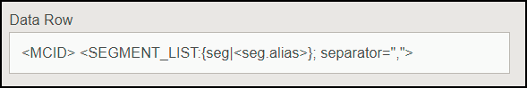

# Solución de problemas de configuración de destino {#destination-setup-troubleshooting}

Información para configurar destinos en Audience Manager y evitar problemas comunes.

## He configurado un destino, pero no veo ningún archivo. ¿Dónde están? {#destination-no-files}

<!-- c_dest_tshooting.xml -->

Los problemas comunes de configuración de destino incluyen los siguientes:

### Destino mal configurado

* **Clave [!UICONTROL UserID] incorrecta:** La clave [!UICONTROL UserID] es la [!UICONTROL MasterDPID] de este destino y es la base de los valores de ID que se saltarán. Aunque se pueda seleccionar una clave [!UICONTROL UserID] en la lista desplegable, no significa necesariamente que haya ID, rasgos o segmentos asignados a este valor. Si el proceso [!UICONTROL Outbound] (que se ejecuta después de crear los destinos) no encuentra ningún usuario asignado a esta clave [!UICONTROL UserID], no se enviarán datos.
* **No se seleccionó ninguna fuente de datos de archivo:** Al elegir cualquier tipo de destino que no sea [!UICONTROL S2S], aparece una sección en la parte inferior de la pantalla denominada [!UICONTROL Configure Data Sources]. Cuando aparece esta sección por primera vez, no se selecciona ningún valor. Si olvida hacer clic en la casilla de verificación [!UICONTROL All First Party] o selecciona individualmente orígenes de datos de la ventana [!UICONTROL Available Data Sources], no se enviarán datos.

### Formato mal configurado

Al seleccionar un formato para los datos salientes, es mejor, si es posible, reutilizar un formato existente. El uso de un formato ya comprobado garantiza que los datos salientes se generen correctamente. Para ver exactamente el formato de un formato existente, haga clic en la opción [!UICONTROL Formats] de la barra de menús y busque el formato por nombre o por número de identificador. Los formatos o macros mal formados utilizados en formatos proporcionarán resultados con formato incorrecto o evitarán que la información se emita completamente.

Para obtener más información sobre la configuración de formatos y el uso de macros, consulte [Macros de formato de archivo](formats/file-formats.md#) y [Macros de formato HTTP](formats/web-formats.md).

### Servidor mal configurado

* **[!DNL FTP]**
   * **[!UICONTROL Domain]**
      * No introduzca prefijos para nombres de host. Si se le da una cuenta [!DNL ftp://hello.com], simplemente ingrese [!DNL hello.com] en este campo.
   * **[!UICONTROL Port/Type Combination]**
      * Para una transferencia de [!DNL FTP], el tipo de transferencia preferido es [!DNL SFTP].
      * Al seleccionar el tipo [!DNL SFTP], el puerto es casi siempre 22.
      * Al seleccionar el tipo [!DNL FTPs/TLS], el puerto es casi siempre 21.
      * El tipo [!DNL FTPs/TLS] no es lo mismo que una transferencia [!DNL FTP] normal. No admitimos transferencias regulares (no seguras) de [!DNL FTP].
   * **[!UICONTROL Remote Path]**
      * Al elegir un subtrazado remoto, debe introducirse sin barra diagonal.
      * Si se supone que el archivo transferido se debe colocar en la subcarpeta [!DNL (root)/inbound], simplemente agregue [!DNL inbound] para la ruta de acceso remota, no [!DNL /inbound].
      * Si envía los archivos a varios directorios por la ruta, introduzca barras oblicuas entre cada directorio. Si se le proporciona la ubicación de [!DNL /inbound/subdirectory1/subdirectory2], debe escribir [!DNL inbound/subdirectory1/subdirectory2] en este campo.
      * Si el archivo debe colocarse en el directorio al que el servidor externo dirige automáticamente, puede dejar este espacio en blanco. No introduzca ningún punto ( . ), barra diagonal ( / ) o cualquier otra cosa.

* **[!DNL S3]**
   * [!DNL S3] es el protocolo de transferencia preferido (más de [!DNL FTP] o [!DNL HTTP]).
      * **[!UICONTROL Bucket]**
         * El nombre del contenedor debe aparecer sin barras diagonales, prefijos, sufijos, etc. Si se le proporciona la dirección [!DNL s3://your-bucket], simplemente debe agregar [!DNL your-bucket] a este campo.
      * **[!UICONTROL Directory]**
         * Deje este campo en blanco a menos que se le proporcione específicamente un subdirectorio en el que se deben colocar los datos. Si se le proporciona la dirección [!DNL s3://your-bucket/your-subdirectory], escriba [!DNL your-bucket] en el campo [!UICONTROL Bucket] y [!DNL your-subdirectory] se debe agregar al campo [!UICONTROL Directory]. No agregue las barras diagonales precedentes.
         * Si tiene que recorrer varios directorios por la ruta, solo entonces debe utilizar barras oblicuas como separadores. Así que una ubicación de [!DNL s3://your-bucket/your-subdirectory1/your-subdirectory2] tendría [!DNL your-bucket] en el campo [!UICONTROL Bucket] y [!DNL your-subdirectory1/your-subdirectory2] en el campo [!UICONTROL Directory].
      * **[!UICONTROL Access / Secret Keys]**
         * Cuando [!DNL TechOps] crea un bloque y proporciona claves de acceso/secretas a un consultor, esas credenciales suelen ser `READ-ONLY` credenciales que se van a entregar al cliente. Estas credenciales no se deben especificar en los campos [!UICONTROL Access / Secret Key], ya que la transferencia fallará (porque esas credenciales son de solo lectura, no de escritura). En caso de que [!DNL TechOps] cree un contenedor y proporcione credenciales, el consultor también debería solicitar un par de claves de Adobe (QUE NO SE DEBE PROPORCIONAR AL CLIENTE) que permita escribir archivos en este contenedor. Esa clave debe añadirse a estos campos.

* **[!DNL HTTP]**
   * **[!UICONTROL Domain]**
      * Especifique la información de prefijo de [!DNL HTTP] entradas. Si se le da una cuenta [!DNL https://superduper.com], escriba [!DNL https://superduper.com] en este campo.
      * **[!UICONTROL URL Prefix]**
         * Al agregar un prefijo [!DNL URL], deje desactivada la barra anterior. La dirección [!DNL https://hello.com/r/x/y/z] debe tener [!DNL https://hello.com] ingresado en el campo [!UICONTROL Domain] y [!DNL r/x/y/z] ingresado aquí en el campo [!UICONTROL URL Prefix].
         * Si no se necesita [!UICONTROL URL Prefix], deje este valor en blanco.
      * **[!UICONTROL Authentication - SSH Key]**
         * Escriba el valor completo de la clave `SSH PRIVATE` en este cuadro, incluidos los encabezados, pies de página y los saltos de línea para garantizar un cifrado y un almacenamiento de claves precisos.

### No hay tiempo suficiente para la generación saliente

El proceso saliente se ejecuta dos veces al día y varios procesos (salientes, publicaciones, transferencias a ubicaciones externas, etc.) deben ejecutarse antes de que un archivo se inserte en su destino final. Una buena regla general es que un destino debe estar completamente configurado al menos 24 horas antes de que pueda esperar que los datos se inserten en una ubicación externa.

### Tamaños de división de archivo demasiado grandes

Al enviar archivos salientes a destinos, puede dividir archivos salientes más grandes en fragmentos de archivo. Asegúrese de que los fragmentos de archivo individuales no superen los 10 GB. Vea también [Nombre de archivo de datos de salida: sintaxis y ejemplos](https://experienceleague.adobe.com/docs/audience-manager/user-guide/implementation-integration-guides/receiving-audience-data/batch-outbound-data-transfers/outbound-file-name-contents.html?lang=en).

## Configuración de los destinos para exportar los Experience Cloud ID, los ID de cliente o los ID de Audience Manager en archivos de datos salientes {#set-up-destinations-export}

Esta página muestra cómo configurar destinos para exportar datos con claves del tipo de identificador que desee en [!UICONTROL Outbound Data Files].

<!-- set-up-destinations-mcid-aamid.xml -->

Los destinos permiten a nuestros clientes activar sus datos en cualquier cantidad de canales digitales. Por ejemplo, pueden exportar datos de audiencia a otras [!DNL Adobe Experience Cloud] soluciones ([!DNL Target], [!DNL Campaign], etc.). O bien, podrían enviar datos a [!UICONTROL DSP]s, [!UICONTROL SSP]s o a cualquier plataforma que esté integrada con Audience Manager. Mantenemos una lista de socios con los que trabajamos en nuestra [página Wiki de integraciones](https://wiki.corp.adobe.com/display/MCPI).

>[!NOTE]
>
>Para ver un tutorial detallado sobre la creación de destinos en la IU de administración, consulte el artículo [Crear o editar destinos de compañía](companies/admin-manage-company-destinations.md#create-edit-company-destinations).

Los clientes desean exportar distintos tipos de ID según el destino. El gráfico de configuración siguiente muestra las opciones que debe seleccionar para exportar información de perfil relacionada con distintos tipos de ID. También le recomendamos que consulte el [Índice de ID en Audience Manager](https://experienceleague.adobe.com/docs/audience-manager/user-guide/reference/ids-in-aam.html?lang=en). Hay tres opciones importantes que se deben tener en cuenta: [!UICONTROL User ID Key], [!UICONTROL Data Source Type] y [!UICONTROL Format]. A continuación detallamos todos ellos.

* [!UICONTROL User ID Key]. En [!UICONTROL Admin UI], vaya a **[!UICONTROL Companies]**. Busque la empresa del cliente y haga clic en ella. Busque la ficha **[!UICONTROL Destinations]** y presione **[!UICONTROL Add Destination]**. En el flujo de trabajo **[!UICONTROL Add Destination]**, seleccione [!UICONTROL User ID Key]. [!UICONTROL User ID Key] filtrará los identificadores entrantes del origen de datos de destino y solo permitirá que pasen los identificadores.

  

* [!UICONTROL Data Source Type]. Seleccione esta opción al crear un destino en la interfaz de usuario de Audience Manager. En primer lugar, seleccione [!UICONTROL Inbound] y, a continuación, seleccione el tipo de ID que desee. Las opciones son:

  

* [!UICONTROL Format]. Esta opción determina el formato de archivo que se va a exportar. En el flujo de trabajo **[!UICONTROL Add Destination]**, en **[!UICONTROL Batch Data]**, seleccione el formato.

Para inspeccionar un formato, vaya a **[!UICONTROL Admin UI > Formats]** y busque el elemento [!UICONTROL Data Row]. Este elemento contiene una macro con el formato de archivo &lt;MCID> en el ejemplo siguiente.

<table id="table_DAEE5BC75DCB4FC690C4BAE41F627DEC"> 
 <thead> 
  <tr> 
   <th colname="col01" class="entry"> Nº de configuración </th> 
   <th colname="col1" class="entry"> 
Clave de usuario 
 </th> 
   <th colname="col2" class="entry"> 
Tipo de Source de datos 
 </th> 
   <th colname="col3" class="entry"> 
Formato 
 </th> 
   <th colname="col4" class="entry"> 
Tipo de ID exportado 
 </th> 
  </tr>
 </thead>
 <tbody> 
  <tr> 
   <td colname="col01"> 1 </td> 
   <td colname="col1"> 
Adobe Audience Manager (0) 
 </td> 
   <td colname="col2"> 
Experience Cloud ID 
 </td> 
   <td colname="col3"> 
&lt;DP_UUID&gt; 
 </td> 
   <td colname="col4"> 
Experience Cloud ID 
 </td> 
  </tr> 
  <tr> 
   <td colname="col01"> 2 </td> 
   <td colname="col1"> 
Adobe Audience Manager (0) 
 </td> 
   <td colname="col2"> 
Experience Cloud ID 
 </td> 
   <td colname="col3"> 
MCID 
 </td> 
   <td colname="col4"> 
UUID DE AUDIENCE MANAGER 
 </td> 
  </tr> 
  <tr> 
   <td colname="col01"> 3 </td> 
   <td colname="col1"> 
Adobe Audience Manager (0) 
 </td> 
   <td colname="col2"> 
Experience Cloud ID 
 </td> 
   <td colname="col3"> 
UUID 
 </td> 
   <td colname="col4"> 
Experience Cloud ID 
 </td> 
  </tr> 
  <tr> 
   <td colname="col01"> 4 </td> 
   <td colname="col1"> 
Adobe Audience Manager (0) 
 </td> 
   <td colname="col2"> 
AUDIENCE MANAGER ID 
 </td> 
   <td colname="col3"> 
&lt;DP_UUID&gt; 
 </td> 
   <td colname="col4"> 
UUID DE AUDIENCE MANAGER 
 </td> 
  </tr> 
  <tr> 
   <td colname="col01"> 5 </td> 
   <td colname="col1"> 
Adobe Audience Manager (0) 
 </td> 
   <td colname="col2"> 
AUDIENCE MANAGER ID 
 </td> 
   <td colname="col3"> 
MCID 
 </td> 
   <td colname="col4"> 
Experience Cloud ID 
 </td> 
  </tr> 
  <tr> 
   <td colname="col01"> 6 </td> 
   <td colname="col1"> 
Adobe Audience Manager (0) 
 </td> 
   <td colname="col2"> 
AUDIENCE MANAGER ID 
 </td> 
   <td colname="col3"> 
UUID 
 </td> 
   <td colname="col4"> 
UUID DE AUDIENCE MANAGER 
 </td> 
  </tr> 
  <tr> 
   <td colname="col01"> 7 </td> 
   <td colname="col1"> 
DPID (cualquier fuente de datos a la que la compañía tenga acceso) 
 </td> 
   <td colname="col2"> 
ID de cliente 
 </td> 
   <td colname="col3"> 
&lt;DP_UUID&gt; 
 </td> 
   <td colname="col4"> 
ID del cliente (DPUUID) 
 </td> 
  </tr> 
  <tr> 
   <td colname="col01"> 8 </td> 
   <td colname="col1"> 
DPID (cualquier fuente de datos a la que la compañía tenga acceso) 
 </td> 
   <td colname="col2"> 
ID de cliente 
 </td> 
   <td colname="col3"> 
MCID 
 </td> 
   <td colname="col4"> 
Experience Cloud ID 
 </td> 
  </tr> 
  <tr> 
   <td colname="col01"> 9 </td> 
   <td colname="col1"> 
DPID (cualquier fuente de datos a la que la compañía tenga acceso) 
 </td> 
   <td colname="col2"> 
ID de cliente 
 </td> 
   <td colname="col3"> 
UUID 
 </td> 
   <td colname="col4"> 
UUID DE AUDIENCE MANAGER 
 </td> 
  </tr> 
  <tr> 
   <td colname="col01"> 10 </td> 
   <td colname="col1"> 
DPID (cualquier fuente de datos a la que la compañía tenga acceso) 
 </td> 
   <td colname="col2"> 
AUDIENCE MANAGER ID 
 </td> 
   <td colname="col3"> 
&lt;DP_UUID&gt; 
 </td> 
   <td colname="col4"> 
UUID DE AUDIENCE MANAGER 
 </td> 
  </tr> 
  <tr> 
   <td colname="col01"> 11 </td> 
   <td colname="col1"> 
DPID (cualquier fuente de datos a la que la compañía tenga acceso) 
 </td> 
   <td colname="col2"> 
AUDIENCE MANAGER ID 
 </td> 
   <td colname="col3"> 
MCID 
 </td> 
   <td colname="col4"> 
Experience Cloud ID 
 </td> 
  </tr> 
  <tr> 
   <td colname="col01"> 12 </td> 
   <td colname="col1"> 
DPID (cualquier fuente de datos a la que la compañía tenga acceso) 
 </td> 
   <td colname="col2"> 
AUDIENCE MANAGER ID 
 </td> 
   <td colname="col3"> 
UUID 
 </td> 
   <td colname="col4"> 
UUID DE AUDIENCE MANAGER 
 </td> 
  </tr> 
 </tbody> 
</table>

## Casos de uso

Supongamos que usa Audience Manager y [!DNL Campaign]. Para poder procesar los datos del cliente en [!DNL Campaign], desea exportar [!UICONTROL Experience Cloud IDs]. En este caso, debe utilizar el número de configuración 3.
