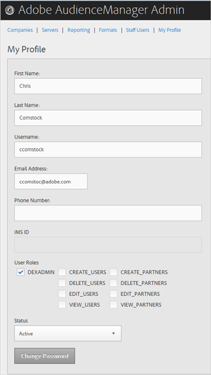

# Mi perfil {#my-profile}

Edite los detalles del perfil de la herramienta de administración de Audience Manager o cambie la contraseña.

<!-- c_my_profile.xml -->

## Editar perfil {#edit-profile}

Vea y edite el perfil de la herramienta de administración de Audience Manager, incluidos el nombre y los apellidos, el nombre de usuario, la dirección de correo electrónico, el número de teléfono, [!UICONTROL IMS ID], los roles de usuario y el estado.

<!-- t_edit_profile.xml -->

1. Haga clic en **[!UICONTROL My Profile]**.

   

2. Rellene los campos:
   * **[!UICONTROL First Name]:** (obligatorio) Especifique su nombre.
   * **[!UICONTROL Last Name]:** (obligatorio) Especifique su apellido.
   * **[!UICONTROL Username]:** (obligatorio) Especifique su primer nombre de usuario.
   * **[!UICONTROL Email Address]:** (obligatorio) Especifique su dirección de correo electrónico.
   * **[!UICONTROL Phone Number]:** Especifique su número de teléfono.
   * **[!UICONTROL IMS ID]:** Especifique su ID de servicio de mensajería de Internet.
   * **[!UICONTROL User Roles]:** Seleccione los roles de usuario que desee:
      * **[!UICONTROL DEXADMIN]:** Proporciona acceso de administrador para realizar tareas en la herramienta de administración de Audience Manager. Si no selecciona esta opción, puede elegir funciones individuales. Estas funciones permiten a los usuarios realizar tareas utilizando llamadas a [!DNL API], pero no en la herramienta de administración.
      * **[!UICONTROL CREATE_USERS]:** Permite que los usuarios creen nuevos usuarios mediante una llamada de [!DNL API].
      * **[!UICONTROL DELETE_USERS]:** Permite que los usuarios eliminen usuarios existentes mediante una llamada de [!DNL API].
      * **[!UICONTROL EDIT_USERS]:** Permite que los usuarios editen usuarios existentes mediante una llamada de [!DNL API].
      * **[!UICONTROL VIEW_USERS]:** Permite que los usuarios vean a otros usuarios en la configuración de su Audience Manager mediante una llamada de [!DNL API].
      * **[!UICONTROL CREATE_PARTNERS]:** Permite que los usuarios creen socios de Audience Manager mediante una llamada de [!DNL API].
      * **[!UICONTROL DELETE_PARTNERS]:** Permite que los usuarios eliminen socios de Audience Manager mediante una llamada de [!DNL API].
      * **[!UICONTROL EDIT_PARTNERS]:** Permite que los usuarios editen los socios de Audience Manager mediante una llamada de [!DNL API].
      * **[!UICONTROL VIEW_PARNTERS]:** Permite que los usuarios vean socios de Audience Manager mediante una llamada de [!DNL API].
   * **[!UICONTROL Status]:** Seleccione el estado deseado:
      * **[!UICONTROL Active]:** Especifica que este usuario es un usuario Audience Manager activo.
      * **[!UICONTROL Deactivated]:** Especifica que este usuario es un usuario desactivado en Audience Management.
      * **[!UICONTROL Expired]:** Especifica que la cuenta de este usuario en Audience Manager ha caducado.
      * **[!UICONTROL Locked Out]:** Especifica que la cuenta de este usuario en Audience Manager está bloqueada.
3. Haga clic en **[!UICONTROL Submit]**.

## Cambiar contraseña {#change-password}

Cambie la contraseña de la herramienta de administración de Audience Manager.

<!-- t_change_password.xml -->

1. Haga clic en **[!UICONTROL My Profile]**.
1. Haga clic en **[!UICONTROL Change Password]**.

   

   La contraseña de Audience Manager debe ser:

   * al menos ocho caracteres de longitud;
   * contener al menos un carácter en mayúscula;
   * Incluir al menos un carácter en minúsculas;
   * contener al menos un número;
   * Incluir al menos un carácter especial;
   * Comenzar y finalizar con un carácter alfanumérico;
   * Comience y termine con un carácter alfanumérico.

1. Especifique la contraseña anterior.
1. Especifique la nueva contraseña y confírmela.
1. Haga clic en **[!UICONTROL OK]**.
