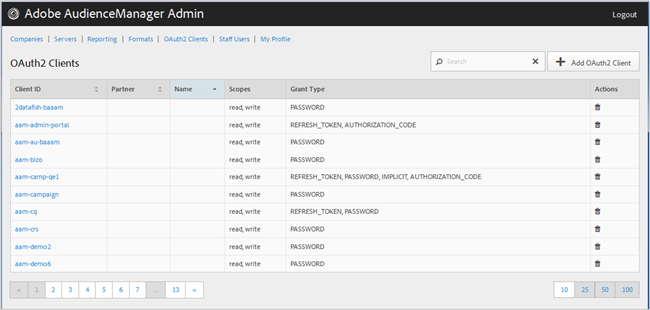

# Clientes de OAuth2 {#oauth-clients}

Utilice la página [!UICONTROL OAuth2 Clients] para ver una lista de [!UICONTROL OAuth2] clientes en su configuración de [!DNL Audience Manager]. Puede editar o eliminar clientes existentes o crear nuevos clientes, siempre que tenga asignados los roles de usuario adecuados.

## Información general {#overview}

<!-- c_oauth.xml -->

>[!NOTE]
>
>Asegúrese de que su cliente lea la documentación de [OAuth2](https://experienceleague.adobe.com/docs/audience-manager/user-guide/api-and-sdk-code/rest-apis/aam-api-getting-started.html?lang=es#oauth) en la Guía del usuario de Audience Manager.

[!DNL OAuth2] es un estándar abierto para la autorización de proporcionar acceso delegado protegido a [!DNL Audience Manager] recursos en nombre de un propietario de recursos.

Puede ordenar cada columna en orden ascendente o descendente haciendo clic en el encabezado de la columna deseada.

Utilice el cuadro [!UICONTROL Search] o los controles de paginación que aparecen en la parte inferior de la lista para encontrar el cliente deseado.

## Crear o editar un cliente de OAuth2 {#create-edit-client}

<!-- t_create_edit_auth.xml -->

Utilice la página [!UICONTROL OAuth2 Clients] en la herramienta Audience Manager [!UICONTROL Admin] para crear un cliente nuevo de [!UICONTROL Oauth2] o para editar uno existente.

1. Para crear un nuevo cliente [!UICONTROL OAuth2], haga clic en **[!UICONTROL OAuth2 Clients]** > **[!UICONTROL Add OAuth2 Client]**. Para editar un cliente [!UICONTROL OAuth2] existente, haga clic en el cliente deseado en la columna **[!UICONTROL Client ID]**.
1. Especifique el nombre que desee para este cliente [!UICONTROL OAuth2]. Tenga en cuenta que este es un nombre solo para el registro.
1. Especifique la dirección de correo electrónico del cliente [!UICONTROL OAuth2]. Hay un límite de una dirección de correo electrónico.
1. En la lista desplegable **[!UICONTROL Partner]**, seleccione el socio que desee.
1. En el cuadro **[!UICONTROL Client ID]**, especifique el ID que desee. Este es el valor que se usa al enviar [!DNL API] solicitudes. El prefijo se rellena automáticamente cuando empieza a escribir después de haber elegido [!UICONTROL Partner] en la lista desplegable del paso anterior. El formato correcto es &lt; *`partner subdomain`*> - &lt; *`Audience Manager username`*>.
1. Seleccione o anule la selección de la casilla de verificación **[!UICONTROL Restrict to Partner Users]**, según desee. Si se selecciona esta casilla de verificación, el usuario debe ser un usuario [!DNL Audience Manager] que aparezca en la lista para el socio seleccionado. Como práctica recomendada, le recomendamos que seleccione esta opción.
1. En la sección **[!UICONTROL Scope]**, active o desactive las casillas de verificación **[!UICONTROL Read]** y **[!UICONTROL Write]**, según desee.
1. En la sección **[!UICONTROL Grant Type]**, seleccione los medios de autorización que desee. Le recomendamos que utilice la configuración predeterminada de las opciones [!UICONTROL Password] y [!UICONTROL Refresh-token].

   * **[!UICONTROL Implicit]**: si selecciona esta opción, se habilita la casilla [!UICONTROL Redirect URI]. Se proporciona al usuario un token de acceso automático después de autenticarse y se envía inmediatamente a la redirección [!DNL URI].
   * **[!UICONTROL Authorization Code]**: si selecciona esta opción, se habilita la casilla [!UICONTROL Redirect URI]. El usuario se devuelve al cliente después de autenticarse y luego se envía a la redirección [!DNL URI].
   * **[!UICONTROL Password]**: el usuario se autentica con una contraseña ingresada por el usuario en lugar de un intento de validación automático a través de un servidor de autorización.
   * **[!UICONTROL Refresh_token]**: se usa para actualizar un token de acceso caducado durante un período de tiempo prolongado.

1. En el cuadro **[!UICONTROL Redirect URI]**, especifique el [!DNL URI] deseado. Esta opción solo se habilita si selecciona los tipos de concesión **[!UICONTROL Implicit]** y **[!UICONTROL Authorization_code]**. El cuadro **[!UICONTROL Redirect URI]** le permite especificar un valor separado por comas de [!DNL URI] valores aceptables. Este es el [!DNL URI] al que se redirige al usuario de un cliente después de aprobar el cliente para el acceso de [!DNL API].
1. Especifique el tiempo de caducidad deseado (en segundos) para el acceso y la caducidad del token de actualización.

   * **[!UICONTROL Access Token Expiration Time]**: número de segundos que un token de acceso es válido después de emitirse. Puede ser nulo para utilizar la plataforma predeterminada (12 horas). También puede ser -1 para indicar que el token de acceso no caduca.
   * **[!UICONTROL Refresh Token Expiration Time]**: número de segundos que un token de actualización es válido después de emitirse. Puede ser nulo para utilizar la plataforma predeterminada (30 días).

1. Haga clic en **[!UICONTROL Save]**.

Para eliminar un cliente [!UICONTROL OAuth2], haga clic en **[!UICONTROL OAuth2 Clients]** y luego haga clic en  en la columna **[!UICONTROL Actions]** del cliente deseado.

>[!MORELIKETHIS]
>
>* [Requisitos y recomendaciones de API](../admin-oauth2/aam-admin-api-requirements.md)
