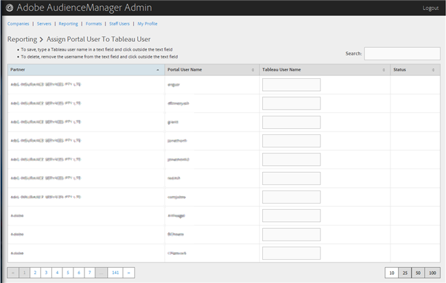

# Asignar un usuario de portal a un usuario de Tableau {#assign-a-portal-user-to-tableau-user}

<!-- t_tabeau.xml -->

Utilice la página [!UICONTROL Reporting] para convertir un usuario del portal en un usuario de [!DNL Tableau]. Esto permite a los usuarios ver [!DNL Tableau] informes en Audience Manager.

1. Haga clic en **[!UICONTROL Reporting]** > **[!UICONTROL Assign Portal User to Tableau User]**.

   

1. Para asignar un usuario, en la fila de socio deseada, escriba un nombre de usuario de [!DNL Tableau] en el campo de texto y haga clic fuera del campo de texto.

Para eliminar una asignación de usuario, en la fila de socio deseada, quite el nombre de usuario del campo de texto y haga clic fuera del campo de texto.
