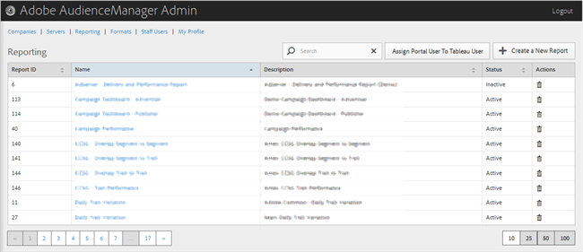

# Informes {#reporting}

Administre informes de Audience Manager creando nuevos informes o editando o eliminando los existentes. También puede asignar un usuario del portal como usuario de [!DNL Tableau].

<!-- c_reporting.xml -->

Puede ordenar cada columna en orden ascendente o descendente haciendo clic en el encabezado de la columna deseada.

Utilice el cuadro [!UICONTROL Search] o los controles de paginación que aparecen en la parte inferior de la lista para encontrar el informe deseado.
