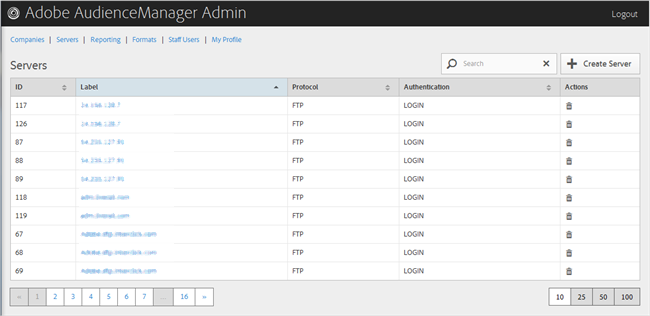

# Resumen de servidores {#servers-overview}

Utilice la página [!UICONTROL Servers] para ver una lista de servidores en la configuración de Audience Manager. Puede editar o eliminar servidores existentes o crear nuevos servidores, siempre que tenga asignados los roles de usuario adecuados.

<!-- c_servers.xml -->

Puede ordenar cada columna en orden ascendente o descendente haciendo clic en el encabezado de la columna deseada. Utilice el cuadro [!UICONTROL Search] o los controles de paginación de la parte inferior de la lista para buscar el servidor deseado.
