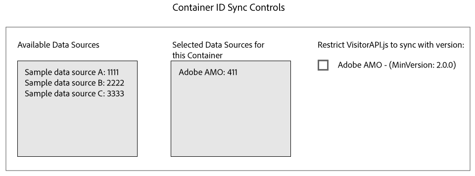

# Sincronización de ID con Media Optimizer {#id-syncing-with-media-optimizer}

De manera predeterminada, todas las empresas sincronizan los datos con [!DNL Adobe Media Optimizer] ([!DNL AMO]). En [!UICONTROL Admin UI], cada contenedor de compañía tiene un origen de datos que administra este proceso. Este origen de datos es [!UICONTROL Adobe AMO] ([!UICONTROL ID] 411). Haga clic en una fila de contenedor (en la ficha [!UICONTROL Containers]) de una empresa seleccionada para deshabilitar esta sincronización predeterminada o para agregar y quitar otras fuentes de datos al proceso de sincronización de [!DNL AMO].

## Estado de sincronización de ID {#id-sync-status}

En la tabla siguiente se describe el estado de sincronización de un origen de datos.

| Estado | Descripción |
|------ | -------- |
| Off | Quite todos los orígenes de datos de [!UICONTROL Selected Data Sources] para este contenedor con el fin de deshabilitar la sincronización de ID con [!DNL AMO] |
| Activado (independientemente de la versión del servicio de ID) | Una fuente de datos se sincroniza con [!DNL AMO] independientemente de la versión del servicio de ID cuando: <ul><li>El origen de datos aparece en la lista [!UICONTROL Selected Data Sources].</li><li>La casilla de verificación [!DNL AMO] *no está* seleccionada.</li></ul> |
| Activado (independientemente de la versión del servicio de ID) | Se sincronizará un origen de datos con [!DNL AMO] con la versión 2.0 (o posterior) del servicio de ID cuando: <ul><li>El origen de datos aparece en la lista [!UICONTROL Selected Data Sources].</li><li>La casilla de verificación [!DNL AMO] *está* seleccionada.</li></ul> |

>[!MORELIKETHIS]
>
>* [Administrar contenedores](../companies/admin-manage-containers.md#task_61DB5CEECC5049DD8D059C642AC3F967)
