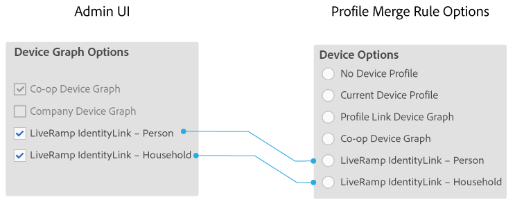

# Opciones de gráfico de dispositivos para compañías {#device-graph-options-for-companies}

Los [!UICONTROL Device Graph Options] están disponibles para las empresas que participan en el [!DNL Adobe Experience Cloud Device Co-op]. Si un cliente también tiene una relación contractual con un proveedor de gráficos de dispositivos de terceros integrado con Audience Manager, esta sección mostrará opciones para ese gráfico de dispositivos. Estas opciones se encuentran en [!UICONTROL Companies] > nombre de la compañía > [!UICONTROL Profile] > [!UICONTROL Device Graph Options].

Esta ilustración utiliza nombres genéricos para las opciones de gráficos de dispositivos de terceros. En producción, estos nombres provienen del proveedor del gráfico del dispositivo y pueden variar de lo que se muestra aquí. Por ejemplo, las opciones de [!DNL LiveRamp] suelen ser (pero no siempre):

* Comenzar con &quot;[!DNL LiveRamp]&quot;
* Contiene un segundo nombre que varía
* Finalizar con &quot;[!UICONTROL - Household]&quot; o &quot;[!UICONTROL -Person]&quot;

## Opciones del gráfico de dispositivos definidas {#device-graph-options-defined}

Las opciones de gráfico de dispositivos que seleccione aquí muestran u ocultan las opciones [!UICONTROL Device Options] disponibles para un cliente [!DNL Audience Manager] cuando crea un [!UICONTROL Profile Merge Rule].

### Gráfico de dispositivos de cooperación {#co-op-graph}

Los clientes que participan en [Adobe Experience Cloud Device Co-op](https://experienceleague.adobe.com/docs/device-co-op/using/about/overview.html?lang=en) utilizan estas opciones para crear [!UICONTROL Profile Merge Rule] con [datos determinísticos y probabilísticos](https://experienceleague.adobe.com/docs/device-co-op/using/device-graph/links.html?lang=en). [!DNL Corporate Provisioning Team] activa y desactiva esta opción mediante una llamada de back-end [!DNL API]. No puede marcar ni desactivar estas casillas en [!DNL Admin UI]. Además, las opciones **[!UICONTROL Co-op Device Graph]** y **[!UICONTROL Company Device Graph]** se excluyen mutuamente. Los clientes pueden pedirnos que activemos uno o el otro, pero no ambos. Si se marca esta opción, se expone el control **[!UICONTROL Co-op Device Graph]** en la configuración de [!UICONTROL Device Options] para un(a) [!UICONTROL Profile Merge Rule].

### Gráfico de dispositivos de la empresa {#company-graph}

Esta opción es para [!DNL Analytics] clientes que usan la métrica [!UICONTROL People] en su grupo de informes [!DNL Analytics]. [!DNL Corporate Provisioning Team] activa y desactiva esta opción mediante una llamada de back-end [!DNL API]. No puede marcar ni desactivar estas casillas en [!DNL Admin UI]. Además, las opciones **[!UICONTROL Company Device Graph]** y **[!UICONTROL Co-op Device Graph]** se excluyen mutuamente. Los clientes pueden pedirnos que activemos uno o el otro, pero no ambos. Cuando está marcada:

* Este gráfico de dispositivos utiliza datos determinísticos que pertenecen a la empresa que está configurando (sin datos probabilísticos).
* [!DNL Audience Manager] crea automáticamente un [!UICONTROL Data Source] llamado `*`nombre de socio`*-Company Device Graph-Person`. En la página de detalles de [!UICONTROL Data Source], los clientes de [!DNL Audience Manager] pueden cambiar el nombre y la descripción del socio y aplicar [controles de exportación de datos](https://experienceleague.adobe.com/docs/device-co-op/using/device-graph/links.html?lang=en) a este origen de datos.
* [!DNL Audience Manager] clientes *no* ven una nueva configuración en la sección [!UICONTROL Device Options] para un [!UICONTROL Profile Merge Rule].

### Gráfico de dispositivos LiveRamp (persona o hogar) {#liveramp-device-graph}

Estas casillas de verificación están habilitadas en [!DNL Admin UI] cuando un socio crea un [!UICONTROL Data Source] y selecciona **[!UICONTROL Use as an Authenticated Profile]** y/o **[!UICONTROL Use as a Device Graph]**. Los nombres de esta configuración están determinados por el proveedor de gráficos de dispositivos de terceros (por ejemplo, [!DNL LiveRamp], [!DNL TapAd], etc.). Cuando se selecciona, significa que la empresa que está configurando utilizará los datos proporcionados por estos gráficos de dispositivos.

>[!MORELIKETHIS]
>
>* [Definición de las opciones de las reglas de combinación de perfiles](https://experienceleague.adobe.com/docs/audience-manager/user-guide/features/profile-merge-rules/merge-rule-definitions.html?lang=en).
>* [Configuración de Data Source y opciones de menú](https://experienceleague.adobe.com/docs/audience-manager/user-guide/features/data-sources/datasources-list-and-settings.html?lang=en)
