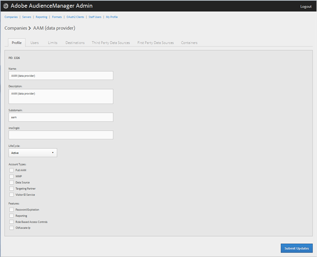
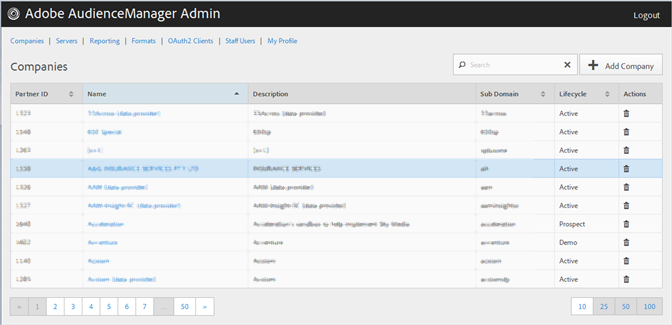

# Crear un perfil de compañía {#create-a-company-profile}

Utilice la página [!UICONTROL Companies] en la herramienta de administración de Audience Manager para crear una nueva compañía.

<!-- t_create_company.xml -->

>[!NOTE]
>
>Debe tener el rol **[!UICONTROL DEXADMIN]** para poder crear nuevas compañías.

1. Haga clic en **[!UICONTROL Companies]** > **[!UICONTROL Add Company]**.
1. Rellene los campos:

   * **[!UICONTROL Name]**: (obligatorio) especifique el nombre de la empresa.
   * **[!UICONTROL Description]**: (obligatorio) proporcione información descriptiva sobre la compañía, como el sector o su nombre completo.
   * **[!UICONTROL Subdomain]**: (obligatorio) especifique el subdominio de la empresa. El texto que introduzca será el que se mostrará como subdominio de la llamada de evento. Esto no se puede cambiar. Debe ser una cadena de [!DNL URL] caracteres no válidos.

     Por ejemplo, si su compañía se llamara [!DNL AcmeCorp], el subdominio sería [!DNL acmecorp].

     Audience Manager usa el subdominio para [!UICONTROL Data Collection Server] (DCS). En el ejemplo anterior, si el [!DNL URL] completo de su compañía en [!UICONTROL DCS] fuera [!DNL acmecorp.demdex.net].

   * **[!UICONTROL Lifecyle]**: especifique el escenario deseado para la compañía:
      * **[!UICONTROL Active]**: especifique que la empresa será un cliente activo de Audience Manager. Una cuenta de [!UICONTROL Active] significa un cliente que paga, no solo por asesoría, sino por el SKU de Audience Manager.
      * **[!UICONTROL Demo]**: especifique que la empresa se utilizará únicamente con fines de demostración. Los datos de los informes se falsificarán automáticamente.
      * **[!UICONTROL Prospect]**: especifique que la empresa es un cliente potencial de Audience Manager, como una empresa a la que se le está dando un [!DNL POC] gratuito o una configuración de cuenta para una demostración de ventas.
      * **[!UICONTROL Test]**: especifique que la empresa se utilizará únicamente con fines de prueba interna.

   * **[!UICONTROL Account Types]**: especifique el conjunto completo de tipos de cuenta para esta compañía. Ningún tipo de cuenta es mutuamente excluyente con ningún otro tipo.
      * **[!UICONTROL Full AAM]**: especifique que la empresa tendrá una cuenta de Adobe Audience Manager completa y los usuarios tendrán acceso de inicio de sesión.
      * **[!UICONTROL MMP]**: especifique que la empresa ha sido habilitada para usar las capacidades [!UICONTROL Master Marketing Profile] ([!UICONTROL MMP]). El [!UICONTROL MMP] permite que las audiencias se compartan en Experience Cloud usando un [!UICONTROL Experience Cloud ID] ([!DNL MCID]) que se asigna a cada visitante y luego Audience Manager usa. Si selecciona este tipo de cuenta, [!UICONTROL Experience Cloud ID Service] también se selecciona automáticamente.

        Para obtener más información, consulte [Audiencias de Experience Cloud](https://experienceleague.adobe.com/docs/core-services/interface/services/audiences/audience-library.html?lang=es).

   * **[!UICONTROL Data Source]**: especifique que la empresa es un proveedor de datos de terceros en Audience Manager.
   * **[!UICONTROL Targeting Partner]**: especifique que la empresa actúa como una plataforma de segmentación para los clientes de Audience Manager.
   * **[!UICONTROL Visitor ID Service]**: especifique que la empresa ha sido habilitada para usar [!UICONTROL Experience Cloud Visitor ID Service].

     [!UICONTROL Experience Cloud Visitor ID Service] proporciona un identificador de visitante universal para todas las soluciones de Experience Cloud. Para obtener más información, consulte la [guía del usuario del Servicio de ID de visitante de Experience Cloud](https://experienceleague.adobe.com/docs/id-service/using/intro/overview.html?lang=es).

   * **[!UICONTROL Agency]**: especifique que la compañía tendrá una cuenta [!UICONTROL Agency].

1. Haga clic en **[!UICONTROL Create]**. Continúe con las instrucciones de [Editar un perfil de compañía](../companies/admin-manage-company-profiles.md#edit-company-profile).

   

## Editar un perfil de compañía {#edit-company-profile}

Edite el perfil de una empresa, incluido su nombre, descripción, subdominio, ciclo de vida y mucho más.

<!-- t_edit_company_profile.xml -->

1. Haga clic en **[!UICONTROL Companies]**, luego busque y haga clic en la empresa que desee para mostrar su página [!UICONTROL Profile].

   Utilice el cuadro [!UICONTROL Search] o los controles de paginación que aparecen en la parte inferior de la lista para encontrar la compañía que desee. Puede ordenar cada columna en orden ascendente o descendente haciendo clic en el encabezado de la columna deseada.

   

1. Edite los campos según sea necesario:

   * **[!UICONTROL Name]**: edite el nombre de la compañía. Este campo es obligatorio.
   * **[!UICONTROL Description]**: edite la descripción de la compañía. Este campo es obligatorio.
   * **[!UICONTROL Subdomain]**: (obligatorio) especifique el subdominio de la empresa. El texto que introduzca será el que se mostrará como subdominio de la llamada de evento. Esto no se puede cambiar. Debe ser una cadena de [!DNL URL] caracteres no válidos.

     Por ejemplo, si su compañía se llamara [!DNL AcmeCorp], el subdominio sería [!DNL acmecorp].

     Audience Manager usa el subdominio para [!UICONTROL Data Collection Server] (DCS). En el ejemplo anterior, si el [!DNL URL] completo de su compañía en [!UICONTROL DCS] fuera [!DNL acmecorp.demdex.net].

   * **[!UICONTROL imsOrgld]**: ([!UICONTROL Identity Management System Organization ID]) Este ID le permite conectar su compañía con Adobe Experience Cloud.
   * **[!UICONTROL Lifecyle]**: especifique el escenario deseado para la compañía:
      * **[!UICONTROL Active]**: especifique que la empresa será un cliente activo de Audience Manager. Una cuenta activa significa un cliente que paga, no solo por asesoría, sino por el SKU de Audience Manager.
      * **[!UICONTROL Demo]**: especifique que la empresa se utilizará únicamente con fines de demostración. Los datos de los informes se falsificarán automáticamente.
      * **[!UICONTROL Prospect]**: especifique que la empresa es un cliente potencial de Audience Manager, como una empresa a la que se le está dando un [!DNL POC] gratuito o una configuración de cuenta para una demostración de ventas.
      * **[!UICONTROL Test]**: especifique que la empresa se utilizará únicamente con fines de prueba interna.
   * **[!UICONTROL Account Types]**: especifique el conjunto completo de tipos de cuenta para esta compañía. Ningún tipo de cuenta es mutuamente excluyente con ningún otro tipo.
      * **[!UICONTROL Full AAM]**: especifique que la empresa tendrá una cuenta de Adobe Audience Manager completa y los usuarios tendrán acceso de inicio de sesión.
      * **[!UICONTROL MMP]**: especifique que la empresa ha sido habilitada para usar las capacidades del perfil de marketing maestro ([!UICONTROL MMP]).

        Si selecciona este tipo de cuenta, **[!UICONTROL Visitor ID Service]** también se selecciona automáticamente.
Para obtener más información, consulte [Audiencias de Experience Cloud](https://experienceleague.adobe.com/docs/core-services/interface/services/audiences/audience-library.html?lang=es).

   * **[!UICONTROL Data Source]**: especifique que la empresa es un proveedor de datos de terceros en Audience Manager.
   * **[!UICONTROL Targeting Partner]**: especifique que la empresa actúa como una plataforma de segmentación para los clientes de Audience Manager.
   * **[!UICONTROL Visitor ID Service]**: especifique que la empresa está habilitada para usar el servicio de ID de visitante de Experience Cloud.

     El servicio de identificación de visitantes de Experience Cloud proporciona un ID de visitante universal en las soluciones de Experience Cloud. Para obtener más información, consulte la [guía del usuario del Servicio de Experience Cloud ID](https://experienceleague.adobe.com/docs/id-service/using/home.html?lang=es).

   * **[!UICONTROL Agency]**: especifique que la compañía tendrá una cuenta de Agencia.
   * **[!UICONTROL Features]**: seleccione las opciones que desee:
      * **[!UICONTROL Password Expiration]**: establece que todas las contraseñas de usuario de esta compañía caduquen pasados 90 días para aumentar la seguridad de Audience Manager.
      * **[!UICONTROL Reporting]**: habilita los informes de Audience Manager para esta compañía.
      * **[!UICONTROL Role Based Access Controls]**: habilitar controles de acceso basados en roles para esta compañía. Los controles de acceso basados en funciones permiten crear grupos de usuarios con diferentes permisos de acceso. Los usuarios individuales dentro de estos grupos pueden acceder entonces solo a funciones específicas de Audience Manager.

1. Haga clic en **[!UICONTROL Submit Updates]**.

## Eliminar un perfil de compañía {#delete-company-profile}

Use la página [!UICONTROL Companies] en la herramienta Audience Manager [!UICONTROL Admin] para eliminar una compañía existente.

<!-- t_delete_company.xml -->

>[!NOTE]
>
>Debe tener el rol [!UICONTROL DEXADMIN] para poder eliminar compañías existentes.

1. Para eliminar una empresa existente, haga clic en **[!UICONTROL Companies]**.

   

1. Haga clic en  en la columna **[!UICONTROL Actions]** de la compañía deseada.
1. Haga clic en **[!UICONTROL OK]** para confirmar la eliminación.
