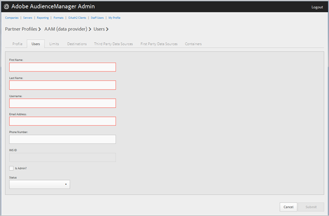

# Administrar usuarios de la empresa {#manage-company-users}

Cree nuevos usuarios de Audience Manager o edite y elimine usuarios existentes.

<!-- t_manage_company_users.xml -->

1. Haga clic en **[!UICONTROL Companies]**, luego busque y haga clic en la empresa que desee para mostrar su página [!UICONTROL Profile].

   Utilice el cuadro [!UICONTROL Search] o los controles de paginación que aparecen en la parte inferior de la lista para encontrar la compañía que desee. Puede ordenar cada columna en orden ascendente o descendente haciendo clic en el encabezado de la columna deseada.
1. Haga clic en la ficha **[!UICONTROL Users]**.
1. Para crear un nuevo usuario, haga clic en **[!UICONTROL Create a New User]**. Para editar un usuario existente, busque y haga clic en el usuario que desee en la columna **[!UICONTROL Username]**.

   

1. Rellene los campos:

   * **[!UICONTROL First Name]**: (obligatorio) especifique el nombre del usuario.
   * **[!UICONTROL Last Name]**: (obligatorio) especifique el apellido del usuario.
   * **[!UICONTROL Username]**: (obligatorio) especifique el nombre de usuario de Audience Manager del usuario. Los nombres de usuario deben ser únicos.
   * **[!UICONTROL Email Address]**: (obligatorio) especifique la dirección de correo electrónico del usuario.
   * **[!UICONTROL Phone Number]**: especifique el número de teléfono del usuario.
   * **[!UICONTROL IMS ID]**: [!UICONTROL Identity Management System ID] del usuario. Este ID permite al usuario vincular soluciones de Adobe a Adobe Experience Cloud.
   * **[!UICONTROL Is Admin]**: convierta a este usuario en un usuario administrativo de Audience Manager. Un administrador tiene todas las funciones de usuario de Audience Manager para este socio.
   * **[!UICONTROL Status]**: al crear un nuevo usuario, este campo se muestra inicialmente como **[!UICONTROL Pending]** hasta que el usuario inicia sesión y restablece la contraseña temporal. Si está editando un usuario existente, puede seleccionar entre los siguientes estados:
      * **[!UICONTROL Active]**: especifica que este usuario es un usuario activo de Audience Manager.
      * **[!UICONTROL Deactivated]**: especifica que este usuario es un usuario de Audience Manager desactivado.
      * **[!UICONTROL Expired]**: especifica que este usuario es un usuario caducado.
      * **[!UICONTROL Locked Out]**: especifica que este usuario es un usuario bloqueado.

1. Haga clic en **[!UICONTROL Submit]**.

## Eliminar un usuario {#delete-user}

Para eliminar un usuario:

1. Haga clic en **[!UICONTROL Companies]**, busque y haga clic en la empresa que quiera y luego haga clic en la ficha **[!UICONTROL Users]**.
1. Haga clic en  en la columna **[!UICONTROL Actions]** del usuario deseado.
1. Haga clic en **[!UICONTROL OK]** para confirmar la eliminación.
